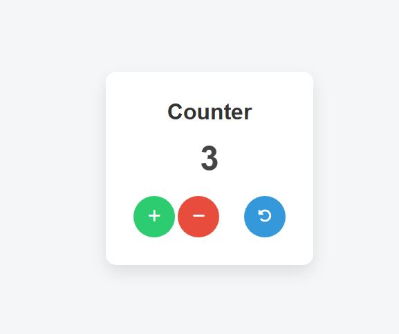

# Counter Application

A simple counter application built using **HTML, CSS, and Vanilla
JavaScript** to demonstrate basic **DOM manipulation**.

The application allows users to increase, decrease, and reset a counter
value using interactive buttons.

------------------------------------------------------------------------

# ScreenShoot


------------------------------------------------------------------------

## Features

-   Increment the counter
-   Decrement the counter
-   Reset the counter to zero
-   Minimalistic and responsive design
-   Interactive buttons with icons

------------------------------------------------------------------------

## Technologies Used

-   HTML5
-   CSS3
-   Vanilla JavaScript
-   Font Awesome (for icons)

------------------------------------------------------------------------

## Project Structure

    counter-app
    │
    ├── index.html
    ├── style.css
    ├── script.js
    └── README.md

------------------------------------------------------------------------

## How It Works

The counter starts at **0**.

-   Clicking **+** increases the number.
-   Clicking **−** decreases the number.
-   Clicking **Reset** returns the counter to **0**.

JavaScript is used to manipulate the **DOM** and update the displayed
value dynamically.

------------------------------------------------------------------------

## Installation

1.  Clone the repository

```{=html}
<!-- -->
```
    git clone https://github.com/randae=abdoerfan/Counter.git

2.  Open the project folder.

3.  Run `index.html` in your browser.

------------------------------------------------------------------------

## Screenshot

Add your project screenshot here:

    

------------------------------------------------------------------------

## Learning Purpose

This project is useful for beginners learning:

-   DOM Manipulation
-   Event Handling in JavaScript
-   Basic UI styling with CSS

------------------------------------------------------------------------

## Author

Developed by **Randa Erfan**

